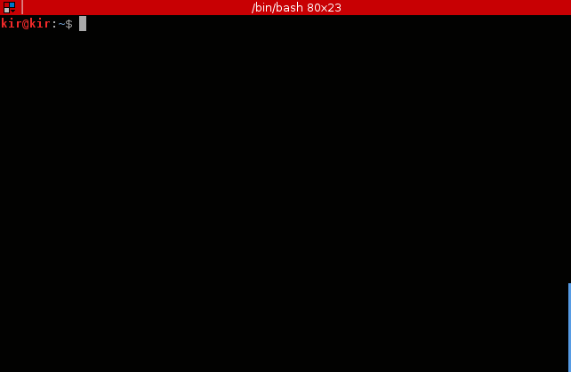

Jarvis
=======
command line notebook written on D language

Version v0.1 ready

### Preview

No it's not looks like this:


It's look like this:




### Dependencies

* [DMD compiller >= 2.071.0](https://dlang.org/download.html)

### Installation

```bash
$ make
$ sudo make install
```

### Usage 

For storing note:
```bash
$ jarvis -n "Some note for Jarvis" --tag "sometag"
```

Additionally you can specify importance for your note with ```-i``` option ( range [1-5] ):
```bash
$ jarvis -n "It's really important note" --tag "big_deal" -i 5
```

To read 2 last notes:
```bash
$ jarvis -r 2
```

To read all notes (latest first) specify ```-r``` less than zero:
```bash
$ jarvis -r -1 
```

### Config file

Basic config for Jarvis:

```
COLOR_SUPPORT:1
FILENAME:storage
```

specify ```1``` for ```COLOR_SUPPORT``` if you want colorful output or ```0``` overwise
specify storage file with ```FILENAME```
